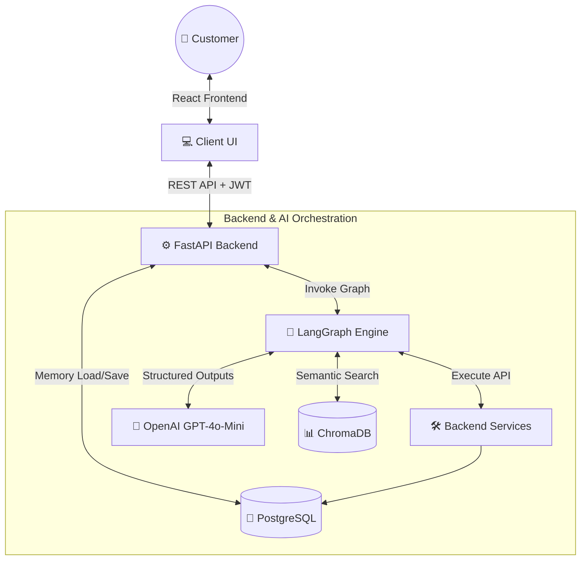
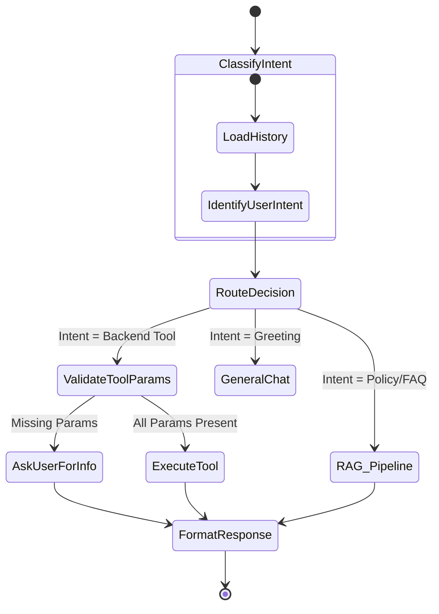
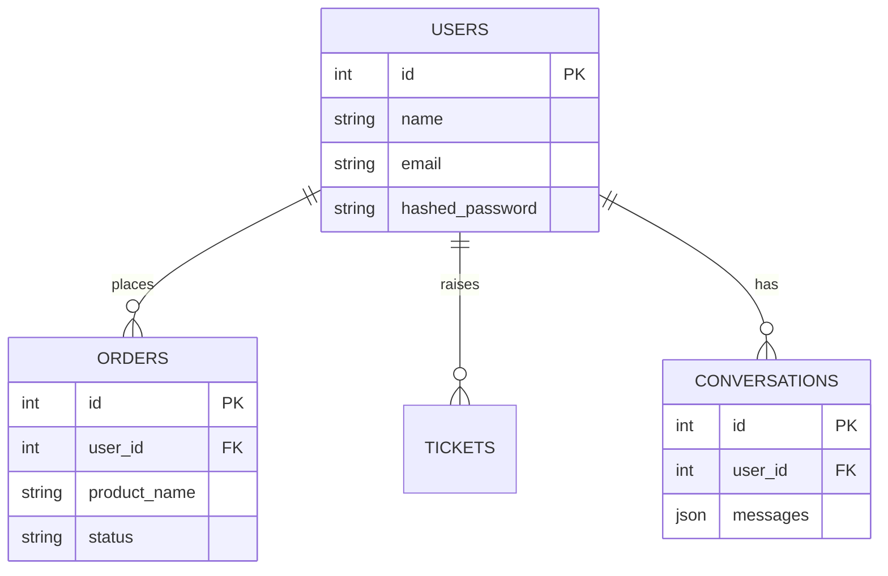

# 🤖 Autonomous AI Customer Support Agent

## 📌 Project Overview
This project is a full-stack, state-of-the-art Autonomous AI Customer Support Agent built to demonstrate advanced software engineering principles. It leverages Large Language Models (LLMs) orchestrated by LangGraph to dynamically resolve customer inquiries, automate backend actions (like processing refunds or tracking shipments), and answer complex policy questions via Retrieval-Augmented Generation (RAG).

## ⚠️ Problem Statement
Modern e-commerce platforms struggle with high volumes of repetitive customer support inquiries. Human agents spend too much time answering simple policy questions or performing rudimentary database lookups (e.g., checking shipping status). Rule-based chatbots are brittle and frustrate users. 

**Solution:** A stateful, AI-driven agent capable of understanding semantic intent, retaining conversational memory, executing actual backend Python logic (Tool Calling), and securely retrieving company documents (RAG) to provide an internship-level, enterprise-grade automated support experience.

## 🏗️ Architecture Diagram
The system is built on a modern decoupled architecture:



## 🔄 Agent Workflow (LangGraph)
Unlike standard linear LLM chains, this agent uses a cyclic graph (State Machine) to make autonomous decisions without relying on fragile if-else text matching.



## 🛠️ Tool Calling Explanation
The agent doesn't just talk; it acts. Using OpenAI's Function Calling API bound to LangChain tools, the AI dynamically generates typed JSON arguments to interact directly with the PostgreSQL database.
- `search_orders(user_id)`: Looks up past purchase history.
- `check_shipping_status(order_id)`: Retrieves tracking IDs.
- `refund_order(order_id)`: Mutates database state to process a refund.
- `create_ticket(issue)`: Opens a human escalation ticket.

### Multi-Turn Parameter Collection
The system natively supports stateful, multi-turn parameter collection. Instead of relying on hardcoded if-else logic in prompts, the agent utilizes a LangGraph `MemorySaver` checkpointer and a dedicated parameter validation node. If a user requests a tool execution without providing required arguments (e.g., asking for an order status without an order ID), the graph intercepts the incomplete tool call, saves the pending task to the graph state, and asks the user for the missing data. Once provided, the graph automatically resumes the original task.

## 📚 RAG Pipeline
For questions regarding company policies (Shipping, Returns, Refunds), the agent bypasses standard tools and routes the query to a dedicated RAG (Retrieval-Augmented Generation) node.
1. Documents are loaded from `knowledge_base.txt`.
2. Chunked using `RecursiveCharacterTextSplitter`.
3. Embedded via `OpenAIEmbeddings`.
4. Stored and retrieved semantically from **ChromaDB**.
5. Injected directly into the LLM's context window to prevent hallucinations.

## 💾 Database Design
Built with SQLAlchemy and managed via Alembic migrations, the PostgreSQL database is fully normalized and supports stateful LangGraph memory via JSON columns.



## 🚀 Setup Instructions

### Option 1: Docker (Recommended)
You can run the entire backend application (FastAPI, PostgreSQL, ChromaDB) via Docker.
1. Clone the repository.
2. Create a `.env` file in the `backend/` directory:
   ```env
   OPENAI_API_KEY=your_api_key_here
   ```
3. Run docker-compose from the root directory:
   ```bash
   docker-compose up --build -d
   ```
4. Start the frontend:
   ```bash
   cd frontend
   npm install
   npm run dev
   ```

### Option 2: Local Development
1. **Database Setup**: Ensure PostgreSQL is running. Update `DATABASE_URL` in your `.env`.
2. **Backend**:
   ```bash
   cd backend
   python -m venv venv
   source venv/bin/activate
   pip install -r requirements.txt
   alembic upgrade head
   python scripts/init_rag.py
   uvicorn app.main:app --reload
   ```
3. **Frontend**:
   ```bash
   cd frontend
   npm install
   npm run dev
   ```

## 📡 API Examples
The backend exposes a clean REST API. Here is an example of the protected chat endpoint:

**Request:**
```http
POST /api/v1/chat HTTP/1.1
Authorization: Bearer <JWT_TOKEN>
Content-Type: application/json

{
  "session_id": 12345,
  "message": "Can you refund my order 998?"
}
```

**Response:**
```json
{
  "reply": "I have successfully processed the refund for your order #998. The status has been updated. Is there anything else I can assist you with?"
}
```
