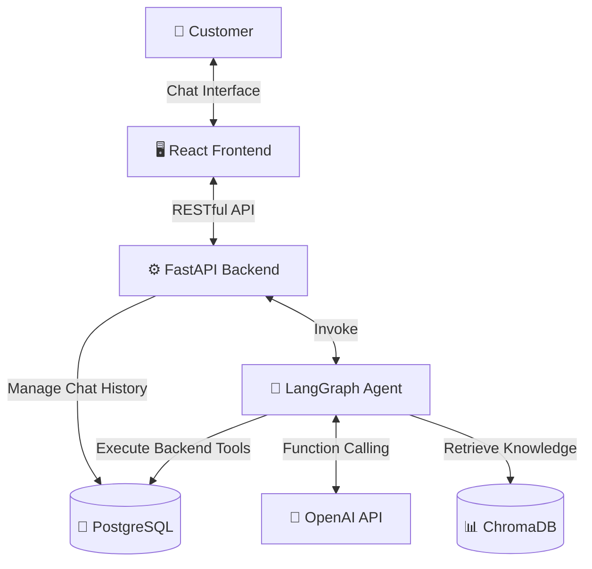
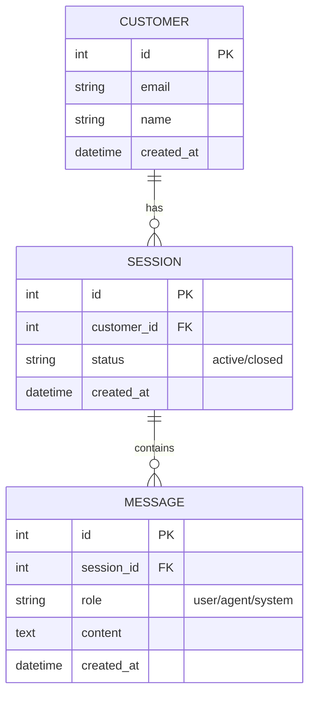
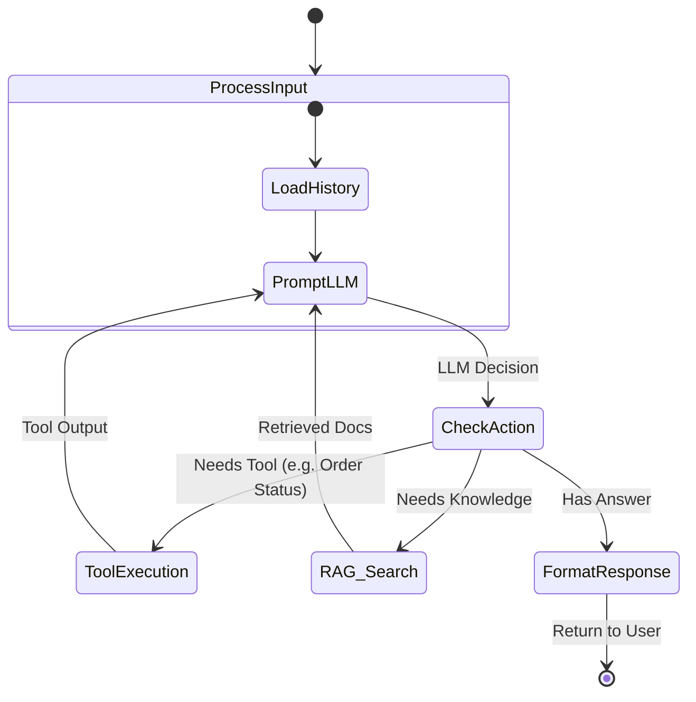

# Autonomous Customer Support Agent

This document outlines the architecture, database schema, agent workflow, and development roadmap for an internship-level Autonomous Customer Support Agent. The system is designed to be impressive but approachable, perfect for a strong software engineering internship portfolio.

## 1. Architecture Diagram

The system follows a standard modern web architecture, integrating an LLM agent capable of tool usage and Retrieval-Augmented Generation (RAG).



> [!NOTE] 
> The architecture separates concerns clearly: React handles the UI, FastAPI acts as the orchestrator and API gateway, LangGraph manages the stateful agent loop, PostgreSQL stores application state and chat history, and ChromaDB manages the vectorized company knowledge base.

## 2. Backend Folder Structure

The project will use a standard modular FastAPI structure to maintain clean separation of concerns.

```text
backend/
├── app/
│   ├── api/                  # API routing (e.g., chat.py, knowledge.py)
│   ├── core/                 # App configuration & environment variables
│   ├── db/                   # Database setup & sessions
│   ├── models/               # SQLAlchemy ORM models (Postgres)
│   ├── schemas/              # Pydantic validation models
│   ├── agent/                # AI Agent Logic
│   │   ├── graph.py          # LangGraph state graph definition
│   │   ├── tools.py          # Tools for OpenAI (e.g., check_order, refund)
│   │   ├── rag.py            # ChromaDB retrieval functions
│   │   └── prompts.py        # System instructions
│   └── main.py               # FastAPI application entry point
├── tests/                    # Pytest test cases
├── requirements.txt          # Python dependencies
└── .env                      # Environment variables
```

## 3. Database Schema (PostgreSQL)

We will keep the schema simple but robust to track users, their chat sessions, and individual messages.



> [!TIP]
> Storing the conversation history in PostgreSQL allows the system to reconstruct LangChain/LangGraph memory easily across different backend restarts.

## 4. Agent Workflow (LangGraph)

The agent utilizes LangGraph to create a robust decision-making loop. It analyzes user input, decides whether it needs to search the knowledge base, execute a tool (like looking up an order), or respond directly.



## 5. API Endpoints

The FastAPI backend will expose the following RESTful endpoints:

### Chat & Sessions
* `POST /api/sessions`: Initialize a new chat session.
* `GET /api/sessions/{session_id}/messages`: Fetch chat history for a session.
* `POST /api/chat`: Send a user message and receive the agent's response.
  * **Payload**: `{"session_id": 123, "message": "Where is my order?"}`
  * **Response**: `{"reply": "Your order is currently out for delivery."}`

### Knowledge Base (Optional Admin Endpoints)
* `POST /api/knowledge`: Upload text or PDF to be chunked, embedded, and stored in ChromaDB.

## 6. Development Roadmap

To ensure a smooth implementation, break the project down into these manageable milestones:

**Phase 1: Foundation (Days 1-2)**
* Initialize Git repository.
* Set up FastAPI backend and React frontend.
* Configure PostgreSQL and write SQLAlchemy models (`Customer`, `Session`, `Message`).

**Phase 2: RAG & Tools (Days 3-5)**
* Set up ChromaDB locally.
* Implement a script to ingest mock company FAQs into ChromaDB.
* Define OpenAI tools (e.g., `get_order_status(order_id)`, `search_faq(query)`).

**Phase 3: LangGraph Agent (Days 6-8)**
* Implement the LangGraph state machine.
* Connect the agent to SQLite/PostgreSQL memory.
* Integrate the RAG and API tools into the agent's graph.

**Phase 4: Frontend & API Integration (Days 9-11)**
* Build a beautiful, responsive chat interface in React using Tailwind CSS.
* Connect React to the `/api/chat` endpoints.
* Implement a "typing" indicator while the agent processes tools.

**Phase 5: Polish & Deployment (Days 12-14)**
* Add error handling and fallback responses.
* Write a comprehensive `README.md` with setup instructions and architecture diagrams.
* (Optional) Containerize with Docker or deploy to Render / Vercel.

> [!IMPORTANT]
> Focus on the quality of your code, clear comments, and robust error handling. Internship recruiters care more about how well you build a simple system than how many buzzwords you can fit into a messy one.
